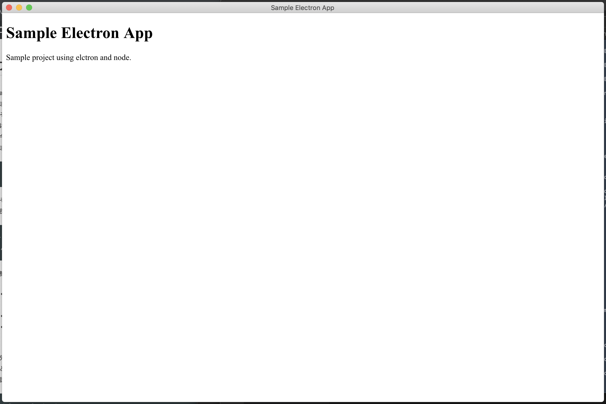

# Electron Tutorial

A tutorial project for electron.

## Setup
```bash
brew install node
npm install -g electron-prebuilt
npm install -g electron-packager
```

## Create Files
1. create `package.json`
```bash
mkdir sampleElectron
cd sampleElectron
npm init -y
```

2. create `index.js`

3. create `index.html`

## Execute the app
```bash
cd ../
electron sampleElectron
```

## Deploy to Mac Application
```bash
electron-packager ./sampleElectron sampleElectronApp --platform=darwin --arch=x64 --electronVersion=1.4.13 --out=sampleElectron/dist
```
- `v1.4.13` is the newest version. (2019/09/06)
- you can change the platform to `all`, `linux`, `win32`, `darwin`.

## Open app
```bash
open sampleElectron/dist/sampleElectronApp-darwin-x64/sampleElectronApp.app/
```


